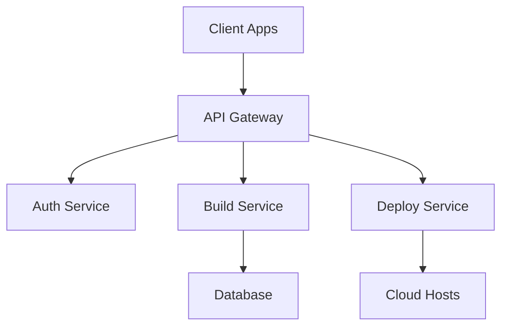

## Overview

Pepperstars provides a modular platform that streamlines software development workflows. You build, test, and deploy applications using its core components: a microservices architecture, integrated CI/CD pipelines, and extensible APIs. These elements work together to accelerate your development cycles while maintaining scalability and security.

## Platform Architecture

Pepperstars uses a layered microservices architecture for flexibility and resilience. Client applications connect to the API gateway, which routes requests to services like authentication, data processing, and deployment engines.



This design ensures high availability. Each service scales independently, and you monitor performance through built-in dashboards.

<Callout kind="info">
  Scale services horizontally by adjusting replicas in your configuration.
</Callout>

## Main Features

Explore the key features that power Pepperstars.

<Columns cols={3}>
  <Card title="CI/CD Pipelines" icon="git-branch" href="/docs/pipelines">
    Automate builds, tests, and deployments with YAML-defined workflows.
  </Card>
  <Card title="API Management" icon="api" href="/docs/apis">
    Secure, versioned APIs with rate limiting and analytics.
  </Card>
  <Card title="Monitoring Dashboard" icon="activity" href="/docs/monitoring">
    Real-time metrics, logs, and alerts for proactive issue resolution.
  </Card>
</Columns>

## Development Workflows

Follow these steps to integrate Pepperstars into your daily development process.

<Steps>
  <Step title="Set Up Project" icon="folder-plus">
    Create a new repository and add the Pepperstars config file.
  </Step>
  <Step title="Define Pipeline" icon="play">
    Write your pipeline YAML to handle build and test stages.

    <CodeGroup tabs="YAML">
      ```yaml
      pipeline:
        stages:
          - name: build
            commands:
              - npm install
              - npm run build
          - name: test
            commands:
              - npm test
      ```
    </CodeGroup>
  </Step>
  <Step title="Trigger Deployment" icon="upload-cloud">
    Push changes to activate automatic deployment to staging or production.
  </Step>
</Steps>

## Customization Options

Tailor Pepperstars to your needs across different environments.

<Tabs>
  <Tab title="Node.js Apps" icon="nodejs">
    Customize build steps for server-side rendering and bundling.

    ```javascript
    module.exports = {
      build: {
        target: 'es2020',
        minify: true,
        sourcemap: process.env.NODE_ENV === 'development'
      }
    };
    ```

    <Expandable title="Advanced Plugins">
      Integrate custom plugins for linting and security scans.

      Use the `plugins` array to add tools like ESLint or Snyk.
    </Expandable>
  </Tab>
  <Tab title="Python Services" icon="python">
    Configure virtual environments and dependency management.

    ```python
    # requirements.txt
    fastapi==0.104.1
    uvicorn[standard]==0.24.0
    ```

    <Callout kind="tip">
      Pin versions to ensure reproducible builds across teams.
    </Callout>
  </Tab>
  <Tab title="Docker Containers" icon="docker">
    Define multi-stage builds for optimized images.

    ```dockerfile
    FROM node:18-alpine AS builder
    WORKDIR /app
    COPY package*.json ./
    RUN npm ci --only=production
    ```
  </Tab>
</Tabs>

<Columns cols={2}>
  <Card title="Next: Quickstart" icon="rocket" href="/docs/quickstart">
    Set up your first project in under 5 minutes.
  </Card>
  <Card title="API Reference" icon="book-open" href="/docs/api">
    Full endpoint documentation and SDKs.
  </Card>
</Columns>