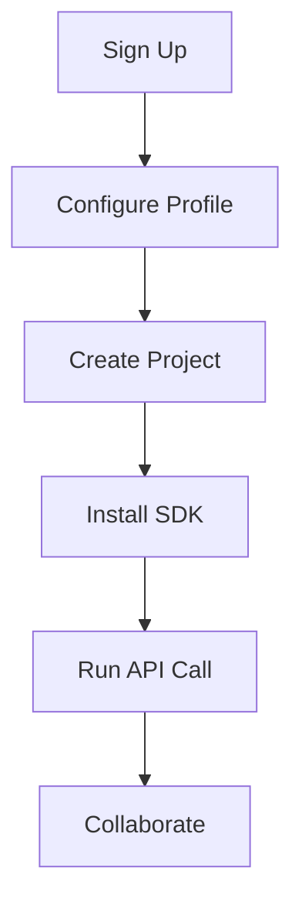

## Overview

Pepperstars provides a collaborative platform for software development teams. You create projects, manage code repositories, and collaborate in real-time. Follow these steps to set up your account, configure your workspace, create your first project, and navigate the dashboard.

<Callout kind="tip">
  Use a strong password during signup. Enable two-factor authentication immediately after login for added security.
</Callout>

## Create Your Account

Sign up takes under two minutes. Visit [pepperstars.dev](https://pepperstars.dev) and choose your preferred method.

<Tabs>
  <Tab title="Email Signup" icon="mail">
    Enter your email, create a password, and verify via the confirmation link sent to your inbox.
  </Tab>
  <Tab title="GitHub OAuth" icon="github">
    Click "Sign up with GitHub" to authorize access. Pepperstars uses your GitHub identity for seamless repo integration.
  </Tab>
  <Tab title="Google OAuth" icon="google">
    Select "Sign up with Google" for quick access using your Google account credentials.
  </Tab>
</Tabs>

## Initial Configuration

After login, complete your profile and workspace setup.

<Steps>
  <Step title="Set Profile Details" icon="user">
    Update your name, avatar, and team preferences in the `<kbd>Account</kbd>` > `<kbd>Profile</kbd>` section.
  </Step>
  <Step title="Configure API Key" icon="key">
    Generate an API key from `<kbd>Settings</kbd>` > `<kbd>API</kbd>`. Store it securely.

    ```bash
    echo "YOUR_API_KEY=pepperstars_abc123xyz" >> .env
    ```
  </Step>
  <Step title="Connect Repository" icon="git-branch">
    Link your GitHub account under `<kbd>Integrations</kbd>` to import existing repositories.
  </Step>
</Steps>

## Set Up Your First Project

Create a new project to experience core features like real-time editing and version control.

<Steps>
  <Step title="Create Project" icon="plus">
    Click `<kbd>New Project</kbd>` in the dashboard. Name it "My First App" and select "Node.js" template.
  </Step>
  <Step title="Install SDK" icon="download">
    Use the Pepperstars SDK for programmatic access.

    <CodeGroup tabs="npm,yarn,pnpm">
      ```bash
      npm install @pepperstars/sdk
      ```
      ```bash
      yarn add @pepperstars/sdk
      ```
      ```bash
      pnpm add @pepperstars/sdk
      ```
    </CodeGroup>
  </Step>
  <Step title="Run First API Call" icon="play">
    Initialize and fetch project data:

    ```javascript
    import { PepperstarsSDK } from '@pepperstars/sdk';

    const sdk = new PepperstarsSDK({ apiKey: 'YOUR_API_KEY' });
    const project = await sdk.projects.get('my-first-app');
    console.log(project.name); // "My First App"
    ```
  </Step>
</Steps>



## Basic Navigation

The dashboard organizes your workflow efficiently.

<Columns cols={3}>
  <Card title="Projects" icon="folder" href="/docs/projects">
    View, create, and manage all your repositories.
  </Card>
  <Card title="Teams" icon="users" href="/docs/teams">
    Invite collaborators and assign roles.
  </Card>
  <Card title="Analytics" icon="bar-chart-3" href="/docs/analytics">
    Track commits, deployments, and performance metrics.
  </Card>
</Columns>

## Next Steps

Explore advanced features:

<Expandable title="Troubleshooting Common Issues" default-open="false">
  - **Login fails?** Clear browser cache and try incognito mode.
  - **API errors?** Verify your `{API_KEY}` hasn't expired.
  - Contact support at support@pepperstars.dev for help.
</Expandable>

You now have a fully functional Pepperstars setup. Invite your team and start building!